<!--
  Artwork is generated: run `python3 tools/build_assets.py` after editing that
  script. Do not hand-edit the files in assets/ — they get overwritten.
  Everything here is self-hosted; there are no third-party image services.
-->

<picture>
  <source media="(prefers-color-scheme: dark)" srcset="assets/banner-dark.svg">
  
</picture>

Lead Software Engineer at **Altrium**, building recurring payments and billing on Java, Spring Boot and Kubernetes.
Before that, capital-markets clearing and settlement in C++ at **LSEG Technology**, full-stack product work, and published research in applied ML and NLP.
I lead a Scrum team, review architecture, and spend a good part of every week mentoring the engineers around me.

Open to conversations about hands-on engineering, architecture and engineering leadership · Most of my day-to-day work lives in private repositories

### Stack

| Area | Technologies |
|:--|:--|
| **Backend** | <kbd>Java</kbd> <kbd>Spring Boot</kbd> <kbd>Microservices</kbd> <kbd>REST</kbd> <kbd>C#</kbd> <kbd>.NET</kbd> |
| **Systems & markets** | <kbd>C++</kbd> <kbd>SWIFT ISO 15022 / 20022</kbd> <kbd>FIX</kbd> <kbd>Clearing & settlement</kbd> |
| **Platform** | <kbd>Kubernetes</kbd> <kbd>AWS EKS</kbd> <kbd>Docker</kbd> <kbd>Jenkins</kbd> <kbd>Redis</kbd> |
| **Data** | <kbd>Oracle</kbd> <kbd>PostgreSQL</kbd> <kbd>SQL Server</kbd> <kbd>MongoDB</kbd> <kbd>PL/SQL</kbd> |
| **Frontend** | <kbd>React</kbd> <kbd>React Native</kbd> <kbd>Angular</kbd> <kbd>TypeScript</kbd> |
| **Quality** | <kbd>Spock</kbd> <kbd>Karate</kbd> <kbd>GoogleTest</kbd> <kbd>JMeter</kbd> <kbd>TDD / BDD</kbd> |
| **ML** | <kbd>Python</kbd> <kbd>NLP</kbd> <kbd>Deep learning</kbd> <kbd>Signal processing</kbd> |

### Work

| Years | Company | Role |
|:--|:--|:--|
| **2023 —** | Altrium | Lead Software Engineer |
| 2021 — 2023 | LSEG Technology · MillenniumIT | Software Engineer |
| 2020 — 2021 | Cube360 | Software Engineer |
| 2019 — 2020 | IFS R&D International | Trainee Software Developer |

### Projects

**[English Buddy](https://github.com/TharindaNimnajith/english-buddy)** — e-learning platform for non-native English speakers, built on audio signal processing, reinforcement learning and NLP. Selected to represent SLIIT at the National Best Quality Software Awards.

**[Viral Pool](https://github.com/TharindaNimnajith/viral-pool-mobile)** — cross-platform React Native app for running social and digital marketing campaigns: dashboards, push notifications, media upload.

### Writing & research

**[English Language Trainer for Non-Native Speakers using Audio Signal Processing, Reinforcement Learning and Deep Learning](https://ieeexplore.ieee.org/document/9774785)**
IEEE Xplore · 21st International Conference on Advances in ICT for Emerging Regions (ICTer), 2021

Occasional notes at [tharindarajapaksha.blogspot.com](https://tharindarajapaksha.blogspot.com).

### Education & leadership

BSc (Hons) in Information Technology, Software Engineering — SLIIT. First Class Honours, Award for the Best Performance, Dean's List for all eight semesters.

I lead a Scrum team at Altrium, run technical interviews, and mentor engineers joining the team.

### Elsewhere

[Email](mailto:tharindarajapakshe@y7mail.com) · [LinkedIn](https://www.linkedin.com/in/tharinda-rajapaksha) · [Blog](https://tharindarajapaksha.blogspot.com)

<picture>
  <source media="(prefers-color-scheme: dark)" srcset="assets/panel-dark.svg">
  
</picture>
